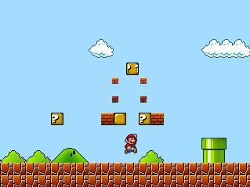



## Mario Game 

### Description

This is a Mario Clone Game. Can be a point of start to any other type of plataform (Kirby's adventure, Adventure Island, Giana Sister's, etc). Have fun with it. It does'nt require direct-X or OpenGL. Use Numeric pad to move, Spacebar to jump, Ctrl to Fire and "Z" to run. F3 Next Level, F9 toogle Fullscreen Mode, F10 to Pause.
 
### More Info
 

             |
---                |---
**Submitted On**   |2011-06-05 20:18:54
**By**             |[Mario Villanueva](https://github.com/Planet-Source-Code/PSCIndex/blob/master/ByAuthor/mario-villanueva.md)
**Level**          |Advanced
**User Rating**    |5.0 (15 globes from 3 users)
**Compatibility**  |VB 6\.0
**Category**       |[Games](https://github.com/Planet-Source-Code/PSCIndex/blob/master/ByCategory/games__1-38.md)
**World**          |[Visual Basic](https://github.com/Planet-Source-Code/PSCIndex/blob/master/ByWorld/visual-basic.md)
**Archive File**   |[Mario\_Game220578652011\.zip](https://github.com/Planet-Source-Code/mario-villanueva-mario-game__1-73939/archive/master.zip)

